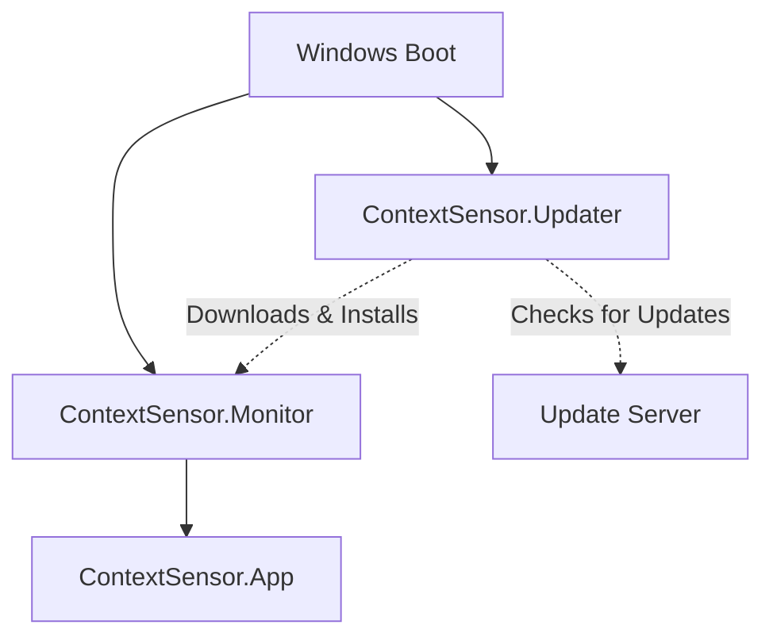
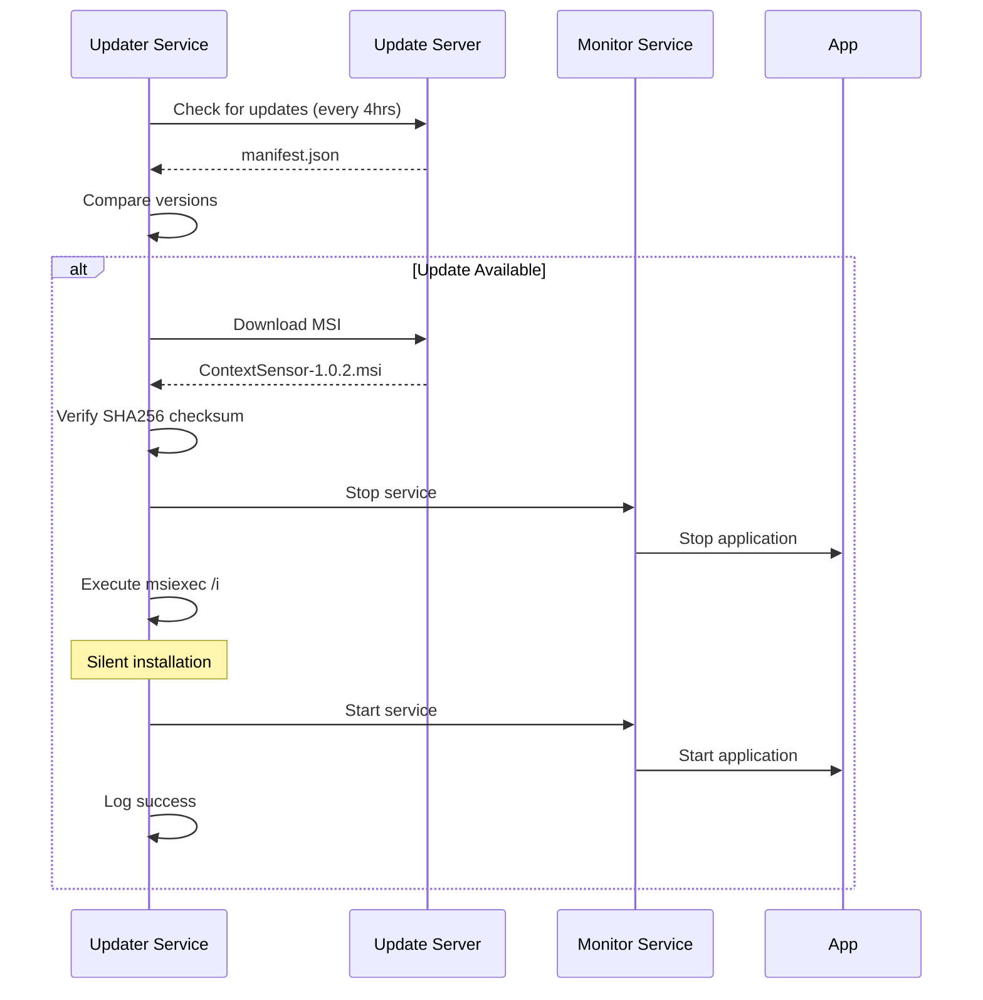

# ContextSensor Installer Guide

Complete guide for installing, configuring, and managing ContextSensor with automatic updates and monitoring.

## Table of Contents

- [Overview](#overview)
- [Architecture](#architecture)
- [Prerequisites](#prerequisites)
- [Building the Installer](#building-the-installer)
- [Installation](#installation)
- [Configuration](#configuration)
- [Updates](#updates)
- [Troubleshooting](#troubleshooting)
- [Deployment Scenarios](#deployment-scenarios)
- [Uninstallation](#uninstallation)

---

## Overview

ContextSensor is packaged as a professional MSI installer with three main components:

| Component | Purpose | Type |
|-----------|---------|------|
| **ContextSensor.App** | Main event monitoring application | Process |
| **ContextSensor.Monitor** | Ensures app is always running | Windows Service |
| **ContextSensor.Updater** | Automatic update management | Windows Service |

### Key Features

- ✅ Multi-platform support (x86 and x64)
- ✅ .NET 8.0 self-contained deployment
- ✅ Automatic service recovery
- ✅ Zero-downtime updates
- ✅ Data preservation during upgrades
- ✅ Enterprise deployment ready

---

## Architecture

### System Overview

```
┌─────────────────────────────────────────────────────────┐
│                    Windows Startup                       │
└────────────────────┬────────────────────────────────────┘
                     │
        ┌────────────┴────────────┐
        │                         │
        ▼                         ▼
┌───────────────┐         ┌───────────────┐
│   Updater     │         │   Monitor     │
│   Service     │         │   Service     │
│               │         │               │
│ • Checks      │         │ • Monitors    │
│   every 4hrs  │         │   Process     │
│ • Downloads   │         │ • Auto-       │
│   Updates     │         │   Restart     │
│ • Installs    │         │ • Backoff     │
│   Silently    │         │   Policy      │
└───────────────┘         └───────┬───────┘
                                  │
                                  ▼
                          ┌───────────────┐
                          │ ContextSensor │
                          │      App      │
                          │               │
                          │ • Event       │
                          │   Monitoring  │
                          │ • Data        │
                          │   Output      │
                          └───────────────┘
```

### Directory Structure

```
C:\Program Files\ContextSensor\          # Application Files
├── ContextSensor.App.exe                # Main application (self-contained)
├── ContextSensor.Monitor.exe            # Monitor service (self-contained)
├── ContextSensor.Updater.exe            # Update service (self-contained)
├── appsettings.json                     # App configuration
├── events.json                          # Event schema
├── monitor.config.json                  # Monitor configuration
└── updater.config.json                  # Updater configuration

C:\ProgramData\ContextSensor\            # Data (Preserved on Upgrade)
├── data\                                # Event output files
│   └── events.log
├── logs\                                # Log files
│   ├── contextsensor.log
│   ├── monitor.log
│   └── updater.log
└── temp\updates\                        # Temporary update downloads

HKLM\Software\ContextSensor\             # Registry Configuration
├── InstallPath                          # C:\Program Files\ContextSensor
├── Version                              # 1.0.1
├── DataPath                             # C:\ProgramData\ContextSensor
└── UpdateUrl                            # Update manifest URL
```

### Service Dependencies



**Service Startup:**
- **Updater**: Automatic (Delayed Start - 2 minutes after boot)
- **Monitor**: Automatic (Immediate)
- **App**: Managed by Monitor service

**Service Recovery:**
- Auto-restart on failure (60s delay)
- 3 restart attempts per 24 hours
- Configured via WiX ServiceConfig

---

## Prerequisites

### For Building

| Requirement | Installation |
|------------|--------------|
| **Windows 10/11** | x64 or x86 |
| **.NET 8.0 SDK** | `winget install Microsoft.DotNet.SDK.8` |
| **WiX Toolset v4** | `dotnet tool install --global wix` |

### For Installation (End Users)

| Requirement | Notes |
|------------|-------|
| **Windows 10** (1803+) or **Windows 11** | x64 or x86 |
| **.NET 8.0 Runtime** | Bundled in self-contained deployment |
| **Administrator Privileges** | Required for service installation |

---

## Building the Installer

### Quick Build

```powershell
cd installer
.\build-installer.ps1
```

**Output:**
- `installer\bin\Release\x64\ContextSensor-x64.msi` (64-bit)
- `installer\bin\Release\x86\ContextSensor-x86.msi` (32-bit)

### Build Options

```powershell
# Clean build
.\build-installer.ps1 -Clean

# Sign installer (code signing certificate required)
.\build-installer.ps1 -Sign -CertificatePath "cert.pfx" -CertificatePassword "pass"

# Debug build
.\build-installer.ps1 -Configuration Debug
```

### Build Process

The build script automatically:
1. Restores NuGet packages
2. Builds solution in Release mode
3. Publishes all components as self-contained single-file executables (x86 + x64)
4. Builds MSI packages for both platforms
5. Calculates SHA256 checksums

**Self-Contained Deployment:**
- No separate .NET Runtime installation required
- Single executable per component (~60-80 MB each)
- All dependencies embedded

---

## Installation

### Interactive Installation

1. Double-click `ContextSensor-x64.msi` (or x86 variant)
2. Follow installation wizard
3. Accept license agreement
4. Choose installation directory (default: `C:\Program Files\ContextSensor`)
5. Click Install

Services start automatically after installation.

### Silent Installation

```powershell
# Basic silent install
msiexec /i ContextSensor-x64.msi /quiet /norestart

# With logging
msiexec /i ContextSensor-x64.msi /quiet /norestart /l*v install.log

# Custom installation directory
msiexec /i ContextSensor-x64.msi INSTALLFOLDER="D:\Apps\ContextSensor" /quiet

# Configure update URL during install
msiexec /i ContextSensor-x64.msi `
  UPDATEURL="https://updates.company.com/contextsensor/manifest.json" `
  /quiet
```

### Network Deployment

#### Group Policy (GPO)

1. Copy MSI to network share: `\\domain\SYSVOL\software\`
2. Group Policy Management → Computer Configuration → Software Settings
3. Right-click Software Installation → New → Package
4. Browse to MSI on network share
5. Select deployment method (Assigned/Published)
6. Configure options and link GPO to target OUs

#### SCCM/Intune

```powershell
# Detection Method
Test-Path "C:\Program Files\ContextSensor\ContextSensor.App.exe"

# Install Command
msiexec /i ContextSensor-x64.msi /quiet /norestart

# Uninstall Command
msiexec /x {A1B2C3D4-E5F6-4A5B-8C7D-9E0F1A2B3C4D} /quiet /norestart
```

### Verification

```powershell
# Check services are running
Get-Service ContextSensor.* | Format-Table Name, Status, StartType

# Expected output:
# Name                      Status  StartType
# ----                      ------  ---------
# ContextSensor.Monitor     Running Automatic
# ContextSensor.Updater     Running Automatic

# Check application is running
Get-Process ContextSensor.App

# Check installation
Test-Path "C:\Program Files\ContextSensor\ContextSensor.App.exe"
Test-Path "C:\ProgramData\ContextSensor"

# Check registry
Get-ItemProperty -Path "HKLM:\Software\ContextSensor"
```

---

## Configuration

### Monitor Service

**Location:** `C:\Program Files\ContextSensor\monitor.config.json`

```json
{
  "Monitoring": {
    "ProcessName": "ContextSensor.App",
    "ProcessPath": "C:\\Program Files\\ContextSensor\\ContextSensor.App.exe",
    "CheckIntervalSeconds": 30,
    "StartupDelaySeconds": 10,
    "MaxRestartAttempts": 3,
    "RestartDelaySeconds": 10,
    "RestartBackoffMultiplier": 2.0,
    "MaxRestartAttemptsPerHour": 10,
    "EnableAutoStart": true
  }
}
```

**Configuration Options:**

| Parameter | Default | Description |
|-----------|---------|-------------|
| `CheckIntervalSeconds` | 30 | How often to check if app is running |
| `StartupDelaySeconds` | 10 | Delay before starting monitoring |
| `MaxRestartAttempts` | 3 | Max consecutive restart attempts |
| `RestartDelaySeconds` | 10 | Initial restart delay |
| `RestartBackoffMultiplier` | 2.0 | Exponential backoff multiplier |
| `MaxRestartAttemptsPerHour` | 10 | Rate limit for restarts |
| `EnableAutoStart` | true | Auto-start app on service start |

**Restart Policy Example:**
- 1st crash: Restart immediately
- 2nd crash: Wait 10 seconds
- 3rd crash: Wait 20 seconds
- After 3 attempts: Stop trying until rate limit window passes

### Updater Service

**Location:** `C:\Program Files\ContextSensor\updater.config.json`

```json
{
  "Update": {
    "UpdateCheckUrl": "https://updates.example.com/contextsensor/manifest.json",
    "CheckIntervalHours": 4,
    "AutoInstall": true,
    "BackupBeforeUpdate": true,
    "VerifyChecksum": true
  }
}
```

**Configuration Options:**

| Parameter | Default | Description |
|-----------|---------|-------------|
| `UpdateCheckUrl` | (required) | URL to update manifest JSON |
| `CheckIntervalHours` | 4 | How often to check for updates |
| `AutoInstall` | true | Automatically install updates |
| `BackupBeforeUpdate` | true | Create backup before updating |
| `VerifyChecksum` | true | Verify update file integrity |

### Applying Configuration Changes

After modifying configuration files:

```powershell
# Restart Monitor service
Restart-Service ContextSensor.Monitor

# Restart Updater service
Restart-Service ContextSensor.Updater

# View service logs
Get-Content "C:\ProgramData\ContextSensor\logs\monitor.log" -Tail 50
Get-Content "C:\ProgramData\ContextSensor\logs\updater.log" -Tail 50
```

---

## Updates

### Automatic Updates (Default)

The Updater service handles updates automatically:

1. ⏱️ **Check** - Every 4 hours, checks configured URL for [`manifest.json`](../../installer/manifest-example.json)
2. 📥 **Download** - Downloads new MSI to temp directory
3. ✅ **Verify** - Validates SHA256 checksum
4. 🛑 **Stop** - Stops Monitor service (which stops app)
5. 📦 **Install** - Executes `msiexec /i package.msi /quiet /norestart`
6. ♻️ **Restart** - Services auto-start, Monitor starts app
7. 💾 **Preserve** - Data in `C:\ProgramData\` is preserved

### Update Process Flow



### Manual Update

```powershell
# Stop services
Stop-Service ContextSensor.Monitor
Stop-Service ContextSensor.Updater

# Install new version
msiexec /i ContextSensor-1.0.2.msi /quiet /norestart

# Services start automatically
# Data is preserved
```

### Update Manifest Format

**Location:** Configured in [`updater.config.json`](../../src/ContextSensor.Updater/updater.config.json:3)

```json
{
  "version": "1.0.2",
  "releaseDate": "2025-11-01T00:00:00Z",
  "downloadUrl": "https://updates.example.com/ContextSensor-1.0.2-x64.msi",
  "checksum": "sha256:e3b0c44298fc1c149afbf4c8996fb92427ae41e4649b934ca495991b7852b855",
  "releaseNotes": "Bug fixes and performance improvements"
}
```

For detailed manifest reference, see [`UPDATE_MANIFEST_REFERENCE.md`](UPDATE_MANIFEST_REFERENCE.md).

### Configuring Update URL

**Option 1: During Installation**
```powershell
msiexec /i ContextSensor-x64.msi `
  UPDATEURL="https://your-server.com/manifest.json" /quiet
```

**Option 2: Edit Configuration**
```powershell
notepad "C:\Program Files\ContextSensor\updater.config.json"
# Change UpdateCheckUrl value
Restart-Service ContextSensor.Updater
```

**Option 3: Via Registry**
```powershell
Set-ItemProperty -Path "HKLM:\Software\ContextSensor" `
  -Name "UpdateUrl" `
  -Value "https://your-server.com/manifest.json"
Restart-Service ContextSensor.Updater
```

---

## Troubleshooting

### Service Issues

#### Services Won't Start

**Symptoms:** Services show "Stopped" status

**Diagnosis:**
```powershell
# Check service status
Get-Service ContextSensor.* | Format-List *

# Check event logs
Get-EventLog -LogName Application -Source "ContextSensor.*" -Newest 20

# Check service logs
Get-Content "C:\ProgramData\ContextSensor\logs\monitor.log" -Tail 50
Get-Content "C:\ProgramData\ContextSensor\logs\updater.log" -Tail 50

# Verify service configuration
sc.exe qc ContextSensor.Monitor
sc.exe qc ContextSensor.Updater
```

**Solutions:**
1. Verify .NET 8.0 Runtime (should be embedded): `dotnet --list-runtimes`
2. Check file permissions: `icacls "C:\Program Files\ContextSensor"`
3. Verify executables exist and are not corrupted
4. Check for conflicting services or ports

#### App Not Starting

**Symptoms:** Monitor service running but app not visible in Task Manager

**Diagnosis:**
```powershell
# Check monitor logs
Get-Content "C:\ProgramData\ContextSensor\logs\monitor.log" -Tail 100

# Check if app path is correct
Get-Content "C:\Program Files\ContextSensor\monitor.config.json"

# Try manual start
& "C:\Program Files\ContextSensor\ContextSensor.App.exe"
```

**Solutions:**
1. Verify [`ProcessPath`](../../src/ContextSensor.Monitor/monitor.config.json:4) in [`monitor.config.json`](../../src/ContextSensor.Monitor/monitor.config.json)
2. Check if app has required permissions
3. Review app logs: `C:\ProgramData\ContextSensor\logs\contextsensor.log`
4. Increase `StartupDelaySeconds` if app needs more time to initialize

### Update Issues

#### Updates Not Detected

**Diagnosis:**
```powershell
# Test manifest URL
Invoke-RestMethod -Uri "https://your-server.com/manifest.json"

# Check updater logs
Get-Content "C:\ProgramData\ContextSensor\logs\updater.log" -Tail 100

# Verify network connectivity
Test-NetConnection -ComputerName your-server.com -Port 443

# Check current version
Get-ItemProperty -Path "HKLM:\Software\ContextSensor" | Select-Object Version
```

**Solutions:**
1. Verify `UpdateCheckUrl` is accessible from target machine
2. Ensure HTTPS certificate is valid
3. Check firewall rules allow outbound HTTPS
4. Verify manifest JSON format is correct
5. Check version comparison logic (updater only installs if manifest version > current)

#### Update Download Fails

**Diagnosis:**
```powershell
# Check available disk space
Get-PSDrive C | Format-Table Name, Used, Free

# Check temp directory
Test-Path "C:\ProgramData\ContextSensor\temp\updates"

# Check event logs for access denied errors
Get-EventLog -LogName Application -Source "ContextSensor.Updater" -Newest 20
```

**Solutions:**
1. Ensure sufficient disk space (need 2x MSI size)
2. Verify temp directory permissions
3. Check if antivirus is blocking downloads
4. Try manual download to verify URL works

#### Update Installation Fails

**Diagnosis:**
```powershell
# Check MSI install logs
Get-Content "$env:TEMP\ContextSensor-*.log" -Tail 100

# Check for locked files
Get-Process | Where-Object { $_.Path -like "*ContextSensor*" }
```

**Solutions:**
1. Verify checksum matches (updater validates automatically)
2. Ensure no other MSI installations are running
3. Close all ContextSensor processes manually if needed
4. Check Windows Installer service is running: `Get-Service msiserver`

### Performance Issues

#### High CPU/Memory Usage

**Diagnosis:**
```powershell
# Monitor resource usage
Get-Process ContextSensor.* | Format-Table Name, CPU, WorkingSet -AutoSize

# Check for excessive restart loops
Select-String -Path "C:\ProgramData\ContextSensor\logs\monitor.log" -Pattern "Restarting"
```

**Solutions:**
1. Increase `CheckIntervalSeconds` in monitor.config.json
2. Increase `CheckIntervalHours` in updater.config.json
3. Review app configuration for event processing frequency
4. Check for application bugs causing crashes (review app logs)

### Data Issues

#### Event Data Not Being Saved

**Diagnosis:**
```powershell
# Check data directory exists
Test-Path "C:\ProgramData\ContextSensor\data"

# Check permissions
icacls "C:\ProgramData\ContextSensor\data"

# Check app configuration
Get-Content "C:\Program Files\ContextSensor\appsettings.json"

# Check app logs
Get-Content "C:\ProgramData\ContextSensor\logs\contextsensor.log" -Tail 50
```

**Solutions:**
1. Verify output path in [`appsettings.json`](../../src/ContextSensor.App/appsettings.json)
2. Ensure data directory has write permissions
3. Check disk space availability
4. Review app logs for write errors

---

## Deployment Scenarios

### Scenario 1: Single Developer Workstation

**Requirements:** Quick local installation

```powershell
# Download and install
.\ContextSensor-x64.msi

# Or silent
msiexec /i ContextSensor-x64.msi /quiet

# Configure for local testing (optional)
notepad "C:\Program Files\ContextSensor\updater.config.json"
# Set CheckIntervalHours to a smaller value for testing
```

### Scenario 2: Enterprise Deployment (100+ Machines)

**Requirements:** Centralized deployment via GPO

**Steps:**
1. Test MSI on pilot machines (5-10 systems)
2. Copy MSI to domain SYSVOL: `\\domain.com\SYSVOL\domain.com\software\`
3. Create GPO:
   - Computer Configuration → Policies → Software Settings → Software Installation
   - New → Package → Browse to network MSI
   - Deployment method: Assigned
4. Configure update server URL via MSI parameter or post-install
5. Link GPO to target OUs
6. Monitor deployment via Group Policy results

**GPO Installation Command:**
```powershell
msiexec /i "\\domain.com\SYSVOL\domain.com\software\ContextSensor-x64.msi" `
  UPDATEURL="https://updates.company.com/contextsensor/manifest.json" `
  /quiet /norestart
```

### Scenario 3: Cloud/Remote Workers

**Requirements:** Deploy to remote machines via Intune/MDM

**Intune Configuration:**
```powershell
# App Type: Line-of-business app
# Detection Rule
Test-Path "C:\Program Files\ContextSensor\ContextSensor.App.exe"

# Install Command
msiexec /i ContextSensor-x64.msi /quiet /norestart

# Uninstall Command
msiexec /x {A1B2C3D4-E5F6-4A5B-8C7D-9E0F1A2B3C4D} /quiet /norestart

# Return Codes
# 0 = Success
# 3010 = Success, reboot required
```

### Scenario 4: Kiosk/Unattended Systems

**Requirements:** High availability, auto-recovery

```powershell
# Install with all defaults
msiexec /i ContextSensor-x64.msi /quiet

# Configure aggressive restart policy
$config = Get-Content "C:\Program Files\ContextSensor\monitor.config.json" | ConvertFrom-Json
$config.Monitoring.MaxRestartAttempts = 999
$config.Monitoring.MaxRestartAttemptsPerHour = 100
$config | ConvertTo-Json | Set-Content "C:\Program Files\ContextSensor\monitor.config.json"

# Configure service recovery
sc.exe failure ContextSensor.Monitor reset= 86400 actions= restart/60000/restart/60000/restart/60000

# Restart service
Restart-Service ContextSensor.Monitor
```

### Scenario 5: Development/Testing

**Requirements:** Local testing with quick updates

```powershell
# Build and install
cd installer
.\build-installer.ps1
msiexec /i bin\Release\x64\ContextSensor-x64.msi /l*v test-install.log

# Set up local update server
cd test/UpdateServer
dotnet run

# Configure updater for local testing
$config = @{
  Update = @{
    UpdateCheckUrl = "http://localhost:8000/manifest.json"
    CheckIntervalHours = 0.1  # Check every 6 minutes
    AutoInstall = $true
    BackupBeforeUpdate = $true
    VerifyChecksum = $true
  }
} | ConvertTo-Json
$config | Set-Content "C:\Program Files\ContextSensor\updater.config.json"

# Restart updater
Restart-Service ContextSensor.Updater
```

---

## Uninstallation

### Interactive Uninstall

1. Open **Settings** → **Apps** → **Installed apps**
2. Find **ContextSensor**
3. Click **...** → **Uninstall**
4. Confirm removal

### Silent Uninstall

```powershell
# Using MSI file
msiexec /x ContextSensor-x64.msi /quiet /norestart

# Using product code (from registry)
msiexec /x {A1B2C3D4-E5F6-4A5B-8C7D-9E0F1A2B3C4D} /quiet /norestart

# With logging
msiexec /x ContextSensor-x64.msi /quiet /norestart /l*v uninstall.log
```

### What Gets Removed

| Location | Removed | Notes |
|----------|---------|-------|
| `C:\Program Files\ContextSensor\` | ✅ Yes | Application files |
| Windows Services | ✅ Yes | Both services removed |
| Start Menu shortcuts | ✅ Yes | Shortcuts removed |
| Registry keys | ✅ Yes | HKLM\Software\ContextSensor |
| `C:\ProgramData\ContextSensor\` | ❌ No | **Data preserved** |

### Complete Removal (Including Data)

```powershell
# 1. Uninstall application
msiexec /x ContextSensor-x64.msi /quiet

# 2. Remove data directory (optional)
Remove-Item -Path "C:\ProgramData\ContextSensor" -Recurse -Force

# 3. Remove registry (if any remnants)
Remove-Item -Path "HKLM:\Software\ContextSensor" -Recurse -Force -ErrorAction SilentlyContinue
```

---

## Best Practices

### Installation

1. **Test on VMs** - Always test new installers on clean VMs before production
2. **Use Silent Install** - For enterprise deployments, use `/quiet` parameter
3. **Enable Logging** - Use `/l*v` parameter to capture detailed logs
4. **Verify Services** - Check services are running after installation
5. **Document Configuration** - Keep records of custom configurations

### Updates

1. **Host on HTTPS** - Always use HTTPS for update manifests and downloads
2. **Verify Checksums** - Ensure checksums are correctly calculated
3. **Code Sign MSI** - Sign installers for production environments
4. **Test Updates** - Test update process on staging environment first
5. **Monitor Success Rate** - Track update installation success across fleet

### Configuration

1. **Backup Configs** - Backup configuration files before modifying
2. **Document Changes** - Keep records of configuration modifications
3. **Test Changes** - Test configuration changes on dev/test systems first
4. **Monitor Logs** - Regularly review service logs for issues
5. **Version Control** - Store configuration templates in version control

### Security

1. **HTTPS Only** - Use HTTPS for all update communications
2. **Verify Checksums** - Enable checksum verification (default: enabled)
3. **Code Signing** - Sign MSI packages with valid certificate
4. **Service Accounts** - Consider using Network Service for production
5. **File Permissions** - Restrict write access to Program Files directory
6. **Audit Logging** - Enable comprehensive logging for security audits

### Monitoring

1. **Service Health** - Monitor service status across fleet
2. **Update Success** - Track update installation success rates
3. **Resource Usage** - Monitor CPU/memory usage
4. **Error Rates** - Track application error rates
5. **Log Retention** - Archive logs for compliance (30 days default)

---

## Support

### Documentation

- **Installation Guide**: This document
- **Update Reference**: [`UPDATE_MANIFEST_REFERENCE.md`](UPDATE_MANIFEST_REFERENCE.md)
- **Build Instructions**: [`BUILD.md`](BUILD.md)
- **Main README**: [`../README.md`](../README.md)

### Log Files

```
C:\ProgramData\ContextSensor\logs\
├── contextsensor.log    # Main application logs
├── monitor.log          # Monitor service logs
└── updater.log          # Updater service logs
```

### Quick Reference Commands

```powershell
# Check service status
Get-Service ContextSensor.* | Format-Table Name, Status, StartType

# View logs
Get-Content "C:\ProgramData\ContextSensor\logs\monitor.log" -Tail 50
Get-Content "C:\ProgramData\ContextSensor\logs\updater.log" -Tail 50

# Restart services
Restart-Service ContextSensor.Monitor
Restart-Service ContextSensor.Updater

# Check version
Get-ItemProperty -Path "HKLM:\Software\ContextSensor" | Select-Object Version

# Force update check (reduce CheckIntervalHours temporarily)
Restart-Service ContextSensor.Updater

# View running processes
Get-Process ContextSensor.*
```

---

**Version:** 1.0.1  
**Last Updated:** 2025-11-01  
**Platform Support:** Windows 10 (1803+), Windows 11 (x86, x64)